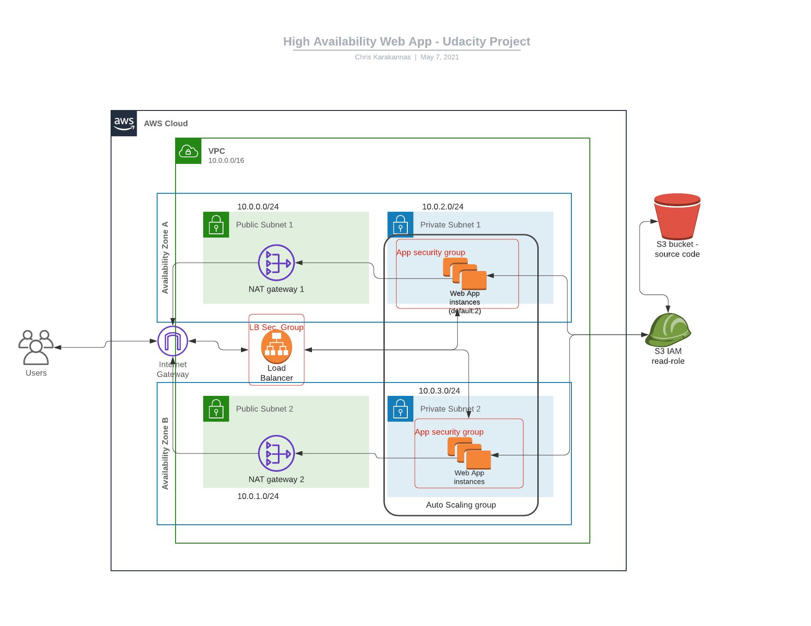

# High Availability WebApp - Project 2

## Summary

This project features a high-availability web application deployed with Infrastructure as Code (IaC) using AWS CloudFormation.

The Infrastructure deployed features two complementary stacks:

- Network stack
- Servers stack

The architecture for this application can be seen on the following diagram:

*High Availability WebApp - Cloud Architecture*

This architecture features EC2 instances hosted in private subnets, managed by a Launch Configuration resource and an AutoScaling Group spanning across two AZs. A load balancer is also provisioned on the two public subnets, configured to forward traffic to the EC2 instances and perform health checks using the instances target group. 

Outbound traffic from the web-app instances is achieved by having defined routing rules to forward traffic to NAT Gateways on public subnets and then to the Internet Gateway, reaching Users outside the VPC.

Finally, an IAM S3 read-only role is attached to the EC2 instances to download the demo web-app code hosted on a public S3 bucket.

You can access the index page and a test page ***(both are subject to AVAILABILITY)*** through the Load Balancer [DNS](http://udaci-webap-1phc2e10upx5u-2136755533.eu-west-2.elb.amazonaws.com) and the test page [URL](http://udaci-webap-1phc2e10upx5u-2136755533.eu-west-2.elb.amazonaws.com/test.html).

## Contents

- web-app-architecture.png => Architecture diagram
- network-stack.yaml => CloudFormation stack for the networking resources
- network-params.json => Parameters for the network stack
- servers-stack.yaml => CloudFormation stack for the servers resources
- server-params.json => Parameters for the servers stack
- <!---->stack.sh => Helper Bash script for creating, updating and deleting CloudFormation stacks using the AWS CLI

Author - Christodoulos Karakannas, May 2021
